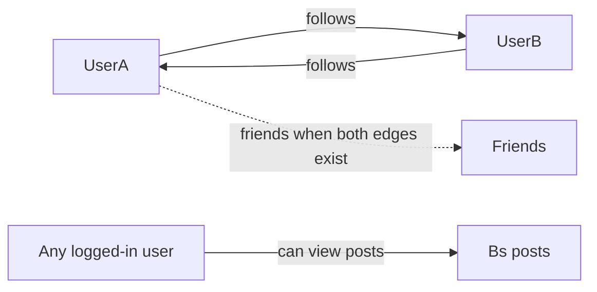

# Phase 4 — Friends & Redesign

Roadmap for the next product cycle after Phase 3 (Postgres, Spotify-on-Nest, logging).

**Goals:** Make the app social and worth looking at. Ship a follow/friends model people understand, expose others’ music posts, and replace the inline-style prototype UI with a cohesive visual language.

**Stack (keep it):** Angular 21 frontend · NestJS 10 backend · Postgres via TypeORM

Companion to [lifepath.md](lifepath.md). When this cycle is done, check off the matching Phase 4 ideas there.

---

## Product rules (locked)

These decisions drive the API and UI. Don’t reopen them mid-build.

| Rule | Meaning |
|------|---------|
| **Follow is one-way** | User A can follow User B with no approval from B. |
| **No requests** | No pending / accept / decline. Follow and unfollow are immediate. |
| **Friends = mutual follow** | A and B are **friends** only when A follows B **and** B follows A. |
| **Posts are not gated on friendship** | You do **not** need to be friends (or even follow) to see someone’s posts once you can reach their profile. Following is for discovery, lists, and “friends” status — not access control. |
| **Self** | You cannot follow yourself. |



---

## Track A — Follow, search, and profiles

**Estimated effort:** 2–3 sessions

**What you learn:** Social graph modeling, search endpoints, public-vs-private product thinking.

### Data model

New table (suggested name `follow`):

| Column | Notes |
|--------|--------|
| `followerId` | User who follows |
| `followingId` | User being followed |
| Unique `(followerId, followingId)` | Prevent duplicates |
| `createdAt` | When the follow happened |

Optional later: denormalized counts on `User` (`followerCount`, `followingCount`) — skip until needed.

New TypeORM **migration** (do not turn `synchronize` back on).

### Backend API (JWT unless noted)

| Method | Path | Behavior |
|--------|------|----------|
| `GET` | `/api/users/search?q=` | Search by username (and maybe email display only for self). Exclude current user. Return id, username, follow status relative to me, whether we are friends. |
| `POST` | `/api/users/:id/follow` | Create follow edge. Idempotent if already following. |
| `DELETE` | `/api/users/:id/follow` | Unfollow. |
| `GET` | `/api/users/:id` | Public profile card: username, follower/following counts, `amIFollowing`, `isFriend`, Spotify avatar if present. |
| `GET` | `/api/users/:id/posts` | That user’s posts (same shape as `/posts/mine`). Auth required; **no** friendship check. |
| `GET` | `/api/users/me/following` | People I follow |
| `GET` | `/api/users/me/followers` | People who follow me |
| `GET` | `/api/users/me/friends` | Mutual follows only |

Keep existing `/api/posts/mine` for “my posts” on the owner’s profile.

### Frontend routes / screens

| Route | Purpose |
|-------|---------|
| `/search` or `/people` | Search users, Follow / Unfollow / Friends badge |
| `/u/:username` or `/users/:id` | Someone else’s profile + their posts |
| `/friends` (optional) | Lists: Friends · Following · Followers |
| `/profile` | Own profile (existing) — add follower counts + link to search |

Dashboard: entry points to Search and Friends.

### UX details

- Search as-you-type or submit-on-Enter; debounce ~300ms.
- Button states: **Follow** · **Following** (unfollow) · **Friends** (still unfollowable).
- Empty states: “No users found”, “No posts yet”.
- After follow/unfollow, refresh status without full page reload.

### Done when (Track A)

- [x] Migration + `Follow` entity wired
- [x] Search, follow, unfollow, profile, and others’ posts APIs work
- [x] Friends list = mutual only
- [x] Logged-in user can open another user’s profile and see their posts **without** following them
- [ ] Basic smoke test on Render after deploy

---

## Track B — Strong UI redesign

**Estimated effort:** 2–3 sessions (can overlap late Track A)

**What you learn:** Design systems on a small SPA, hierarchy, motion without noise.

Today the UI is mostly inline styles and a functional prototype look. This track is a **full visual pass**, not a coat of paint on the same layout.

### Design direction (decide once, then implement)

Pick one clear identity and stick to it. Avoid the usual AI defaults (generic purple gradients, cream + terracotta serif, broadsheet newspaper layouts).

Suggested direction for this music app (adjust if you prefer):

- **Brand:** Keep or refine the product name used on Render (“Wishare” / Spotify-test — settle one public name).
- **Mood:** Late-night listening — deep charcoal/ink backgrounds, warm accent (not Spotify green clone unless you want brand adjacency), high-contrast type.
- **Typography:** Expressive display + readable body (load via Google Fonts or similar — not Inter/Roboto/system as the hero voice).
- **Layout:** Shared shell (nav + content), one job per screen, no card spam in heroes.
- **Motion:** 2–3 intentional transitions (page enter, follow button, post list) — presence, not noise.

Use the **frontend-design** skill when implementing screens.

### Implementation shape

1. **Design tokens** in [frontend/src/styles.scss](../frontend/src/styles.scss) — CSS variables for color, type scale, spacing, radii.
2. **App shell** — top or side nav: Home, Search, Create, Profile, Friends; logged-out minimal nav.
3. **Shared components** — buttons, inputs, user row, post block, empty state (standalone Angular components, not one-off inline styles).
4. **Pass every route** — home, login, register, dashboard, create-post, own profile, Spotify callback/profile, new people/friends pages.
5. **Responsive** — usable on phone and desktop; don’t ship desktop-only.

### Done when (Track B)

- [x] Global tokens + shell replace scattered inline styles on primary flows
- [x] First viewport of marketing/home reads as one composition with a strong brand signal
- [x] Follow/search/profile screens match the same language
- [x] You’d screenshot the live URL for a portfolio without apologizing for the UI

---

## Suggested build order

```
1. Track A data + APIs (follow + search + others’ posts)
2. Minimal UI for search / follow / foreign profile (can be rough)
3. Track B design tokens + shell
4. Restyle all screens into the new system
5. Polish friends lists + empty states + motion
6. Deploy, reconnect Spotify if needed, verify on production
```

Do **not** block the social graph on a perfect redesign. Ship followable users first, then make it beautiful.

---

## Explicitly out of scope (this cycle)

- Follow approval / blocking / muting
- Private accounts or post-level visibility controls
- DMs or notifications infrastructure
- Likes/reactions (nice later; don’t couple to follow)
- Rewriting the stack

---

## Definition of done (whole cycle)

- Friends model matches the product rules above
- User search + follow/unfollow live on production
- Other users’ posts viewable without mutual follow
- UI feels like a product, not a Nest/Angular demo
- [lifepath.md](lifepath.md) Phase 4 checkboxes updated for what you actually shipped
